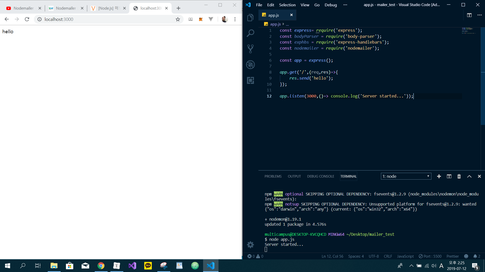
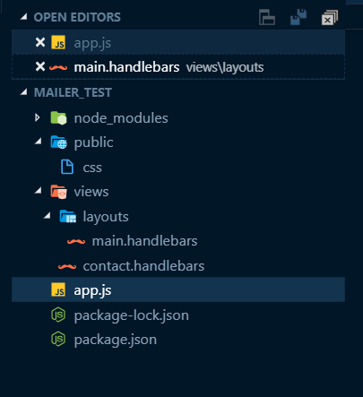

# Portfolio2 하면서 해결했던 것

# Setting

> 믿고 써도 되는가를 판단하는 기준 - 최근에 업데이트가 되었는가

* [pyenv - win](<https://github.com/pyenv-win/pyenv-win>)

```bash
$ pip install pyenv-win --target $HOME/.pyenv
```

* 시스템 환경 변수 편집 > 환경 변수 > 시스템 변수 > Path

```text
C:\Users\multicampus\AppData\Local\Programs\Python\Python36\
C:\Users\multicampus\AppData\Local\Programs\Python\Python36\Scripts\
C:\Users\multicampus\.pyenv\pyenv-win\bin
C:\Users\multicampus\.pyenv\pyenv-win\shims
```

* bash 껐다가 켜고 pyenv 쳐보면 나온다

```bash
$ pyenv install 3.6.8
```

* disable 누르고 close
* bash에서

```bash
$ vi ~/.bash_profile
```

```bash
export PATH="/c/Users/student/.pyenv/bin:$PATH"
```

* 시행착오 후 정리
  * gitbash에서 쓰기 위해 3.7.2 사용

```bash
$ pyenv install 3.7.2
$ pyenv global 3.7.2
$ pyenv rehash
$ python -V
=== version 확인 후, 가상환경 원하는 폴더에서 ===
$ python -m venv django-venv
$ cd django-venv
$ source Scripts/activate
=== 그러면, 이렇게 될 것 ===
(django-venv) ~

그 후 npm install을 통해 이전에 깔아두었던 npm service 를 설치한다.
npm run serve 를 통해 서버를 실행시킨다.
```

* mac

```bash
$ pyenv virtualenv 3.6.7 django-venv
=== 원하는 폴더에서 ===
$ pyenv local django-venv
=== django-venv 라는 이름의 가상 공간 생성 ===
$ vi .python-version
=== 이 숨김파일에서 버전관리 확인 가능 ===
$ django-admin startproject moviepjt .
=== "." 현재 directory에 manage.py 와 프로젝트 폴더 생성 ===

=== 내부와 외부에서 찍어보면 차이를 알 수 있다 ==
$ pip list
```

*기존에는 폴더 안에 폴더를 또 만들어서 프로젝트를 진행했지만, 그러면 가상환경에서 하는 의미가 없음. 바로 그 디렉토리에서 진행한다*

* pip freeze를 해 놓은 뒤 넘어와서 설치할 때에는

```bash
$ pip install -r requirements.txt
```

* 작업중에 finder 여는 법 : `open .`
* 작업중에 vscode 여는 법 : `code .` : 설정 필요
* finder에서 terminal 여는 법 : 
* finder에서 vscode 여는 법 : 


- git pull origin master 내 브랜치로 땡겨오는 방법.

vscode vetur plugin  설치하면 코드 단어에 색상이 입혀진다.


크롬에 최적화되어이씁니다 띄우기.

```bash
1.npm install vue-browser-detect-plugin

2.main.js에
import browserDetect from "vue-browser-detect-plugin";
Vue.use(browserDetect);

3.App.vue -> export default 부분에 뷰 속성 추가
beforeCreate() {
 if(browser !== 'Chrome'){
  alert("본 사이트는 크롬버전에 최적화되어있습니다.")
 }
}
```


- backToTop npm install guide
  - [여기](https://www.npmjs.com/package/vue-backtotop)


- 새로운 저장소 파서 저장하기

- git remote add pb(별명) git://github.com/paulboone/ticgit.git(깃주소)
- git push pb master 

```vue
position="center bottom"
```


- open-on-hover : 버튼 같다대기만 하면 어떤 이벤트가 발생하게 함

- img 크기 조절하는 방법.

  ```css
  .container{
  overflow:hidden;
  }
  .container img{
      margin-top:50%;
  }
  ```

  

- 구글 번역 기능

- ```html
  <script type="text/javascript">
    function googleTranslateElementInit() {
        new google.translate.TranslateElement({pageLanguage: 'ko', includedLanguages: 'en,ja,ko', layout: google.translate.TranslateElement.InlineLayout.SIMPLE}, 'google_translate_element');
  }
  </script>
  <script type="text/javascript" src="//translate.google.com/translate_a/element.js?cb=googleTranslateElementInit"></script>
  ```

  index.html 에 추가

- ```html
  <v-toolbar-items><div id="google_translate_element"></div></v-toolbar-items>
  ```

  원하는 위치에 추가하기


## mailer mailgun 

- > npm install --save express body-parser express-handlebars nodemailer

- > npm install -g nodemon

- app.js 파일 생성 후 코드 입력

- ```js
  const express= require('express');
  const bodyParser = require('body-parser');
  const exphbs = require('express-handlebars');
  const nodemailer = require('nodemailer');
  
  const app = express();
  
  // view engine setup
  app.engine('handlebars',exphbs());
  app.set('view engine','handlebars');
  
  //body parser middleware
  app.use(bodyParser.urlencoded({ extended: false }));
app.use(bodyParser.json());
  
  app.get('/',(req,res)=>{
      res.send('hello');
  });
  
  app.listen(3000,()=> console.log('Server started...'));
  ```
  
- > node app.js 

- 

- new folder - public 폴더 생성. 밑에 css 추가

- 코드 추가

- ```js
  const express= require('express');
  const bodyParser = require('body-parser');
  const exphbs = require('express-handlebars');
  const path = require('path');
  const nodemailer = require('nodemailer');
  
  const app = express();
  
  // view engine setup
  app.engine('handlebars',exphbs());
  app.set('view engine','handlebars');
  
  //static folder
  app.use('/public',express.static(path.join(__dirname,'public')));
  
  //body parser middleware
  app.use(bodyParser.urlencoded({ extended: false }));
  app.use(bodyParser.json());
  
  app.get('/',(req,res)=>{
      res.send('hello');
  });
  
  app.listen(3000,()=> console.log('Server started...'));
  ```

- > nodemon

- 서버 실행시키고 views 폴더 생성 및 contact.handlebars 파일생성

- 코드 수정

- ```js
  const express= require('express');
  const bodyParser = require('body-parser');
  const exphbs = require('express-handlebars');
  const path = require('path');
  const nodemailer = require('nodemailer');
  
  const app = express();
  
  // view engine setup
  app.engine('handlebars',exphbs());
  app.set('view engine','handlebars');
  
  //static folder
  app.use('/public',express.static(path.join(__dirname,'public')));
  
  //body parser middleware
  app.use(bodyParser.urlencoded({ extended: false }));
  app.use(bodyParser.json());
  
  app.get('/', (req,res)=>{
      // res.send('hello');
      // 여기 수정
      res.render('contact');
  });
  
  app.listen(3000,()=> console.log('Server started...'));
  ```

- 왜그런진 모르겠지만 경로 에러가 생겼다! 경로대로 파일구조를 만들어서 다시 돌렸더니 실행되었음..
  

- ORIGINAL HTML/CSS FORM DOWNLOAD:
  [http://www.traversymedia.com/download...](https://www.youtube.com/redirect?q=http%3A%2F%2Fwww.traversymedia.com%2Fdownloads%2Fresponsiveform.zip&event=video_description&v=nF9g1825mwk&redir_token=Hfz51M6YtVi0febKHl5y3n5U7OF8MTU2Mjk5MzQwNUAxNTYyOTA3MDA1)

- 여기에서 폼을 대충 다운로드 받아보자.

### - app.js 수정

```js
const express= require('express');
const bodyParser = require('body-parser');
const exphbs = require('express-handlebars');
const path = require('path');
const nodemailer = require('nodemailer');

const app = express();

// view engine setup
app.engine('handlebars',exphbs());
app.set('view engine','handlebars');

//static folder
app.use('/public',express.static(path.join(__dirname,'public')));

//body parser middleware
app.use(bodyParser.urlencoded({ extended: false }));
app.use(bodyParser.json());

app.get('/', (req,res)=>{
    // res.send('hello');
    // 여기 수정
    res.render('contact');
});

app.post('/send',(req,res)=>{
    const output = `
    <p>You have a new contact request</p>
    <h3>Contact Details</h3>
    <ul>
        <li>Name : ${req.body.name}</li>
        <li>Company : ${req.body.company}</li>
        <li>Email : ${req.body.email}</li>
        <li>Phone : ${req.body.phone}</li>
    </ul>
    <h3>Message</h3>
    <p>${req.body.message}</p>
    `;

    test(output);

});

async function test(output){
    // Generate test SMTP service account from ethereal.email
  // Only needed if you don't have a real mail account for testing
  let testAccount = await nodemailer.createTestAccount();

  // create reusable transporter object using the default SMTP transport
  let transporter = nodemailer.createTransport({
    service:'naver',
    host: "smtp.ethereal.email",
    port: 587,
    secure: false, // true for 465, false for other ports
    auth: {
      user: 'dkyou7@naver.com', // generated ethereal user
      pass: '[보내는 메일의 실제 비밀번호]' // generated ethereal password
    }
  });

  // send mail with defined transport object
  let info = await transporter.sendMail({
    from: '"메일링 테스트으" <dkyou7@naver.com>', // sender address
    to: "[보내고자하는 메일주소]", // list of receivers
    subject: "Hello ✔", // Subject line
    text: "Hello world?", // plain text body
    html: output // html body
  });

  console.log("Message sent: %s", info.messageId);
  console.log("Preview URL: %s", nodemailer.getTestMessageUrl(info));
//   alert("보내기 완료!");
//   return res.render('contact',{msg:"이메일 보내기 완료!"});
}
test().catch(console.error);

app.listen(3000,()=> console.log('Server started...'));
```

- main.js

- ```html
  <!DOCTYPE html>
  <html lang="en">
  <head>
    <meta charset="UTF-8">
    <meta name="viewport" content="width=device-width, initial-scale=1.0">
    <meta http-equiv="X-UA-Compatible" content="ie=edge">
    <title>Acme Web Design</title>
    <link href="https://maxcdn.bootstrapcdn.com/font-awesome/4.7.0/css/font-awesome.min.css" rel="stylesheet" integrity="sha384-wvfXpqpZZVQGK6TAh5PVlGOfQNHSoD2xbE+QkPxCAFlNEevoEH3Sl0sibVcOQVnN" crossorigin="anonymous">
    <link rel="stylesheet" href="https://cdnjs.cloudflare.com/ajax/libs/animate.css/3.5.2/animate.css" />
    <link rel="stylesheet" href="public/css/style.css">
  </head>
  <body>
    <div class="container">
      <h1 class="brand"><span>Acme</span> Web Design</h1>
      <div class="wrapper animated bounceInLeft">
        <div class="company-info">
          <h3>Acme Web Design</h3>
          <ul>
            <li><i class="fa fa-road"></i> 44 Something st</li>
            <li><i class="fa fa-phone"></i> (555) 555-5555</li>
            <li><i class="fa fa-envelope"></i> test@acme.test</li>
          </ul>
        </div>
        <div class="contact">
          <h3>Email Us</h3>
          {{msg}}
          <form method="POST" action="send">
            <p>
              <label>Name</label>
              <input type="text" name="name">
            </p>
            <p>
              <label>Company</label>
              <input type="text" name="company">
            </p>
            <p>
              <label>Email Address</label>
              <input type="email" name="email">
            </p>
            <p>
              <label>Phone Number</label>
              <input type="text" name="phone">
            </p>
            <p class="full">
              <label>Message</label>
              <textarea name="message" rows="5"></textarea>
            </p>
            <p class="full">
              <button type='submit'>Submit</button>
            </p>
          </form>
        </div>
      </div>
    </div>
  </body>
  </html>
  ```

  ```css
  *{
    box-sizing: border-box;
  }
  
  body{
    background:#92bde7;
    color:#485e74;
    line-height:1.6;
    font-family: 'Segoe UI', Tahoma, Geneva, Verdana, sans-serif;
    padding:1em;
  }
  
  .container{
    max-width:1170px;
    margin-left:auto;
    margin-right:auto;
    padding:1em;
  }
  
  ul{
    list-style: none;
    padding:0;
  }
  
  .brand{
    text-align: center;
  }
  
  .brand span{
    color:#fff;
  }
  
  .wrapper{
    box-shadow: 0 0 20px 0 rgba(72,94,116,0.7);
  }
  
  .wrapper > *{
    padding: 1em;
  }
  
  .company-info{
    background:#c9e6ff;
  }
  
  .company-info h3, .company-info ul{
    text-align: center;
    margin:0 0 1rem 0;
  }
  
  .contact{
    background:#f9feff;
  }
  
  /* FORM STYLES */
  .contact form{
    display: grid;
    grid-template-columns: 1fr 1fr;
    grid-gap:20px;
  }
  
  .contact form label{
    display:block;
  }
  
  .contact form p{
    margin:0;
  }
  
  .contact form .full{
    grid-column: 1 / 3;
  }
  
  .contact form button, .contact form input, .contact form textarea{
    width:100%;
    padding:1em;
    border:1px solid #c9e6ff;
  }
  
  .contact form button{
    background:#c9e6ff;
    border:0;
    text-transform: uppercase;
  }
  
  .contact form button:hover,.contact form button:focus{
    background:#92bde7;
    color:#fff;
    outline:0;
    transition: background-color 2s ease-out;
  }
  
  /* LARGE SCREENS */
  @media(min-width:700px){
    .wrapper{
      display: grid;
      grid-template-columns: 1fr 2fr;
    }
  
    .wrapper > *{
      padding:2em;
    }
  
    .company-info h3, .company-info ul, .brand{
      text-align: left;
    }
  }
  ```

- https://proal.tistory.com/76 여기가 잘 나와있다.


