# Firebase 기초

[TOC]

## 1. 웹서비스

### AWS / IDC / Cloud(Firebase) 비교

IDC - 직접 구축한다.

WAS - 빌린다.

Firebase - 다 준비되어있다.

## 2. Firebase Hosting

### 0) [Hosting #1] Hosting 이해 및 custom 도메인 연결

```bash
npm install -g firebase-tools
mkdir firebase-test
cd firebase-test
firebase login
```


- 구글 아이디로 로그인 해주면 이렇게 된다.

### 1) firebase 초기화

```bash
firebase init
```

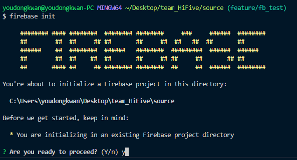

- Y 로 Firebase init을 진행

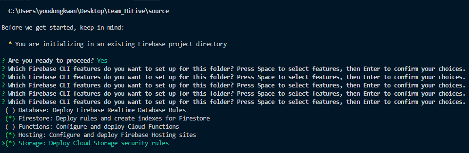

- 사용할 서비스를 선택
  - Firestore
    - Firestore 관련 서비스를 사용하면서 선택하지 않을 시 firestore.rules 관련 오류 발생
    - Firebase 에서도 Firestore를 시작 해 주어야 한다.
  - Hosting
  - Storage
    - Storage를 사용하면서 선택을 하지 않을 시 storage.rules 관련 오류 발생
    - Firebase 에서도 Storage 를 시작 해 주어야 한다.

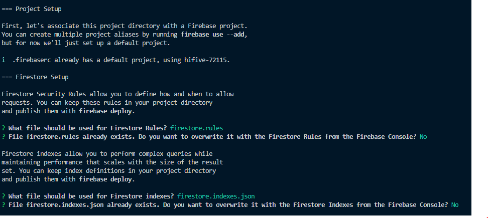

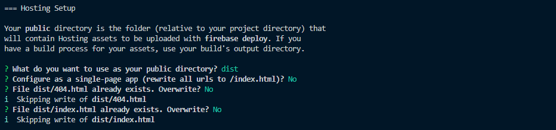

- Hosting Setup의 `Public directory`에 주의 하자
  - build 된 app의 `index.html` 이 존재하는 `dist` 폴더로 지정한다.

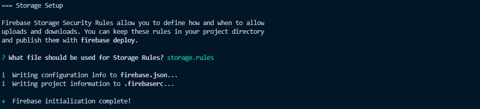

### 2) 컴파일

```bash
npm run build
```

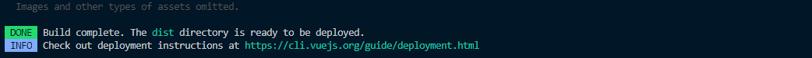

```bash
cd public
```

- public 폴더 안에서 웹 작업 수행 후

### 3) 베포

```bash
firebase deploy
```

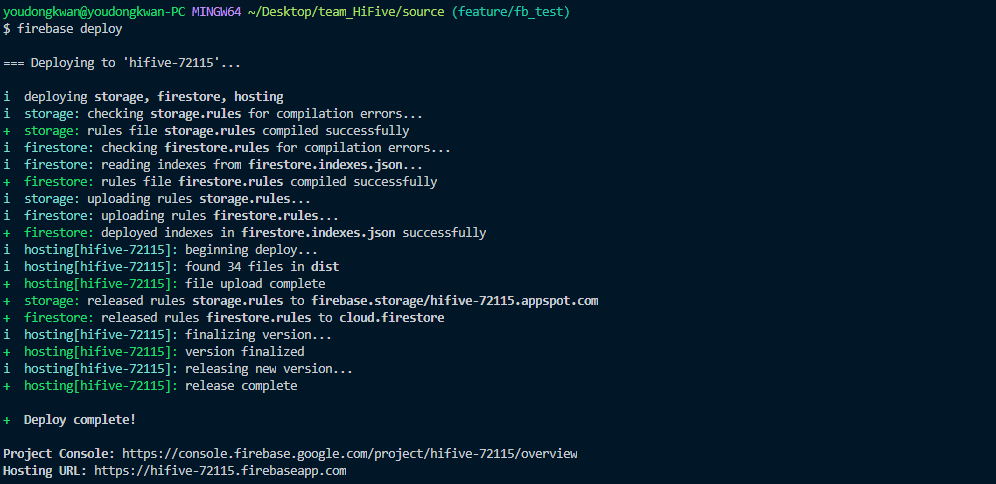

###  - 에러났던거 #1

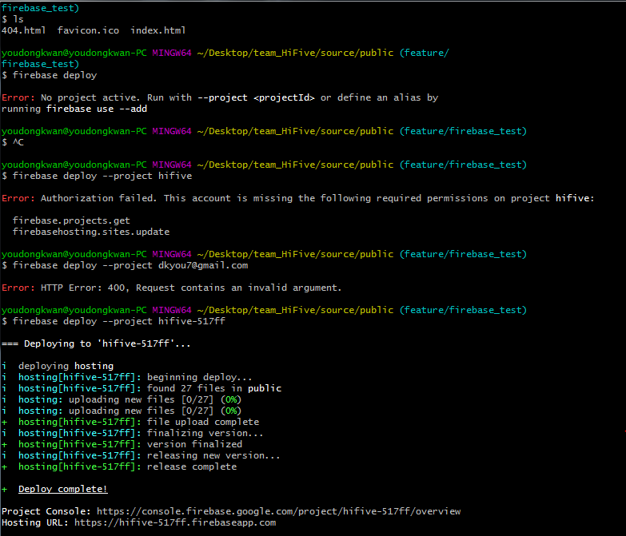

- 에러가 났었는데 프로젝트 명과 연결시켜주는 명령어 실행했더니 베포되었다.

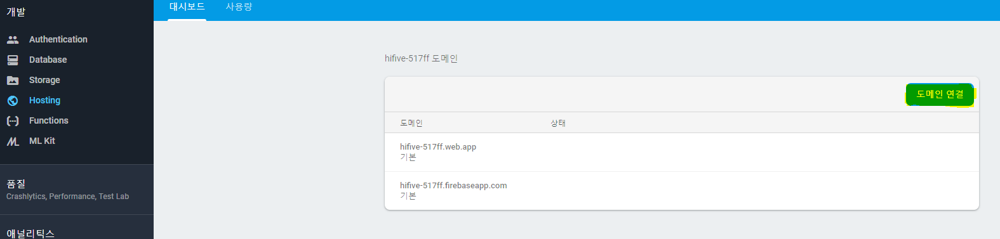

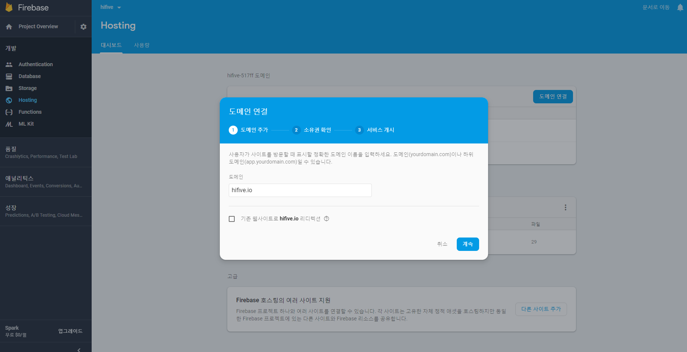

### - 에러났던거 #2

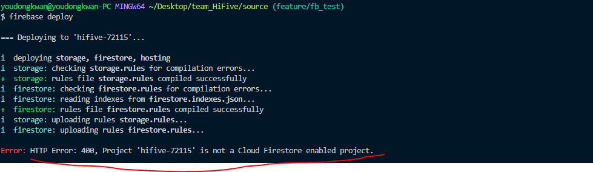

이런식으로 에러났는데 firebase에서 초기화 되지 않아서 그런 것임. 가서 활성화 한번 해주면 된다.

- .io 형식으로 도메인 연결해준다.

- 도메인은 후이즈(?) 라는 곳을 쓴다고 한다.
- <https://www.youtube.com/watch?v=TQ5OPoYKKpI> 7:00~

### 4) firebase functions

- 파이어베이스에서 접속 기록을 log로 남길 수 있다고 해서 설치해보았다.

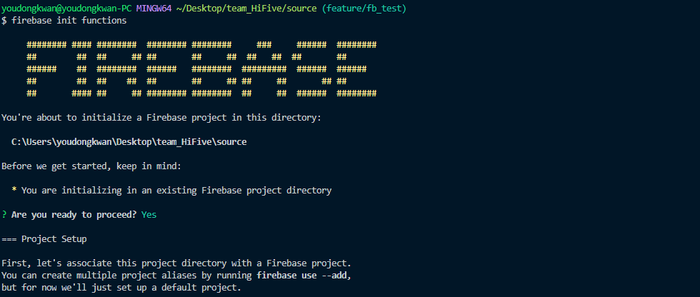

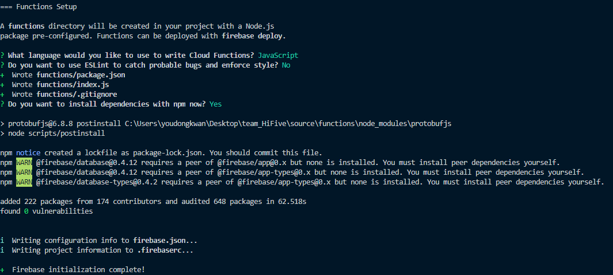

Function 작성

- Function 은 functions 폴더 안의 index.js 에 작성한다.

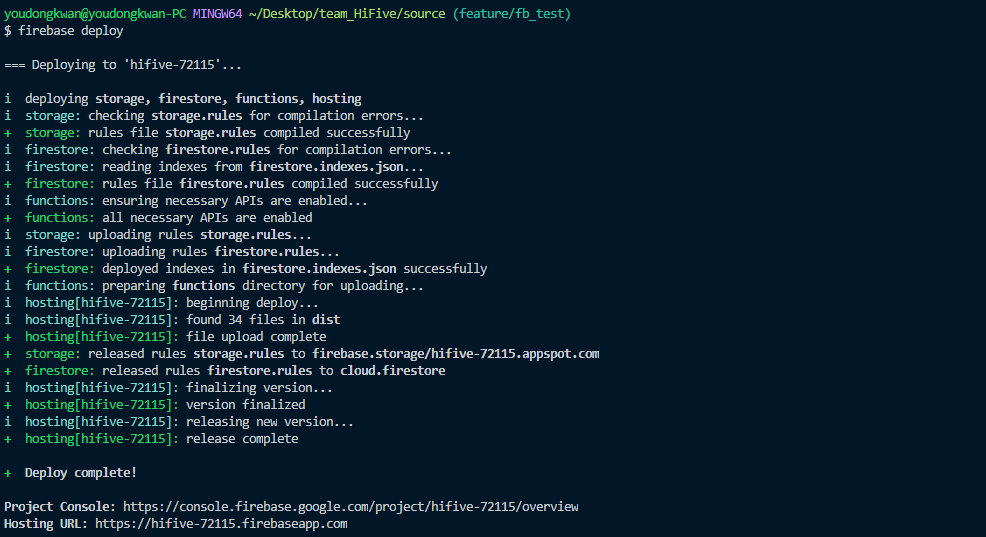

- 추가되어 베포 해준다

```bash
firebase deploy
```


## 3. Firebase Auth

### [Auth #1] 기존 사용자 로그인

- firebase javascript 추가

```js
<script defer src="https://www.gstatic.com/firebasejs/5.10.1/firebase-app.js"></script>

<script defer src="https://www.gstatic.com/firebasejs/5.10.1/firebase-auth.js"></script>
<script defer src="https://www.gstatic.com/firebasejs/5.10.1/firebase-database.js"></script>
<script defer src="https://www.gstatic.com/firebasejs/5.10.1/firebase-functions.js"></script>
<script defer src="https://www.gstatic.com/firebasejs/5.10.1/firebase-storage.js"></script>
```

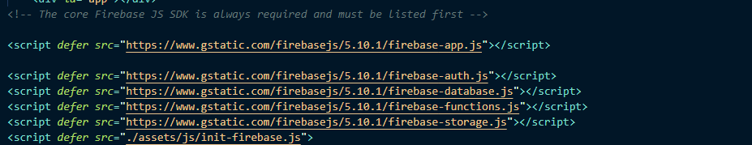

*** 에러 *** 이유는 모르겠는데 `defer` 붙이려면 다 붙여줘야 에러 안남.. (1시간 찾음)

- firebase 초기화

```js
// TODO: Replace the following with your app's Firebase project configuration
var firebaseConfig = {
  apiKey: "...",
    authDomain: "...",
    databaseURL: "..",
    projectId: "...",
    storageBucket: "",
    messagingSenderId: "....",
    appId: "..."
};

// Initialize Firebase
firebase.initializeApp(firebaseConfig);
```

- html script

```html
<div class="userInfo" v-if="!isLogin">
            로그인 해주세요!
            <input type="email" id='txtemail' name="username" placeholder="Username" required>
            <input type="password" id='txtpasswd' name="password" placeholder="Password" required>
            <input type="submit" v-on:click="toggleSignIn" value="Login">
    <ul>
        <li><a href="#" @click="anonymously">체험해보기</a></li>
        <li><a href="#" @click="handleSignUp">회원가입</a></li>
        <li><a href="#">Forget password?</a></li>
    </ul>
</div>
<div class="userInfo" v-else>
    {{currentUser.userEmail}} 님 안녕하세요!
    <input type="submit" v-on:click="toggleSignIn" value="Logout">
</div>
```

- script 구현

```js
<script>

export default {
    data(){
        return {
            currentUser:{
                userID:'',
                userEmail:'',
                userName:''
            },
            isLogin:false
        }
    },
     methods:{
        toggleSignIn() {
            if(firebase.auth().currentUser===null){
                this.isLogin=false;
            }
            if (firebase.auth().currentUser) {
                // [START signout]
                firebase.auth().signOut();
                this.isLogin=false;
                // [END signout]
            } else {
                var email = document.getElementById('txtemail').value;
                var password = document.getElementById('txtpasswd').value;
                
                if (email.length < 4) {
                    alert('Please enter an email address.');
                return;
                }
                if (password.length < 4) {
                alert('Please enter a password.');
                return;
                }
                // Sign in with email and pass.
                // [START authwithemail]
                firebase.auth().signInWithEmailAndPassword(email, password).then(function(res){  
                    //console.log(res);
                }).catch(function(error) {
                // Handle Errors here.
                var errorCode = error.code;
                var errorMessage = error.message;

                // [START_EXCLUDE]
                if (errorCode === 'auth/wrong-password') {
                    alert('Wrong password.');
                } else if(errorCode === 'auth/user-not-found'){
                    alert("유저 정보가 존재하지 않습니다.");
                }
                else {
                    alert(errorMessage);
                }
                console.log(error);
                // [END_EXCLUDE]
                });
                // [END authwithemail]
            }
        }
    },
    mounted:function(){
        // 현재 로그인한 회원 정보를 알 수 있는 함수, 존재하면 딕셔너리, 아니면 null 값이 나온다.
        // 뷰는 이런식으로 써줘야한다.
        firebase.auth().onAuthStateChanged(user=>{
            if(user){
                console.log(user.email);
                this.currentUser.userEmail=user.email;
                this.isLogin=true;
            }else{
                console.log("유저정보 없음");
            }
        })
    }
   
}
</script>
```

### [Auth #2] 신규 사용자 회원 가입

```js
<script>

export default {
    data(){
        // ...
    },
     methods:{
        handleSignUp() {
            var email = document.getElementById('txtemail').value;
            var password = document.getElementById('txtpasswd').value;
            if (email.length < 4) {
                alert('Please enter an email address.');
                return;
            }
            if (password.length < 4) {
                alert('Please enter a password.');
                return;
            }
            // Sign in with email and pass.
            // [START createwithemail]
            firebase.auth().createUserWithEmailAndPassword(email, password).catch(function(error) {
                // Handle Errors here.
                var errorCode = error.code;
                var errorMessage = error.message;
                // [START_EXCLUDE]
                if (errorCode === 'auth/weak-password') {
                alert('The password is too weak.');
                } else {
                alert(errorMessage);
                }
                console.log(error);
                // [END_EXCLUDE]
            });
            // [END createwithemail]
            // this.checkLogin();
        }
    }
}
</script>
```

### [Auth #3] Social Login 구현

#### 1) Facebook login


- facebook developer 이동 후 시작하기

- 설정 
  - 기본 설정


## 4. Firebase Real Time Database

## 5. Firebase Storage

## 6. Firebase Cloud Function

## 7. 기타 Library 소개


# firebase 다루기