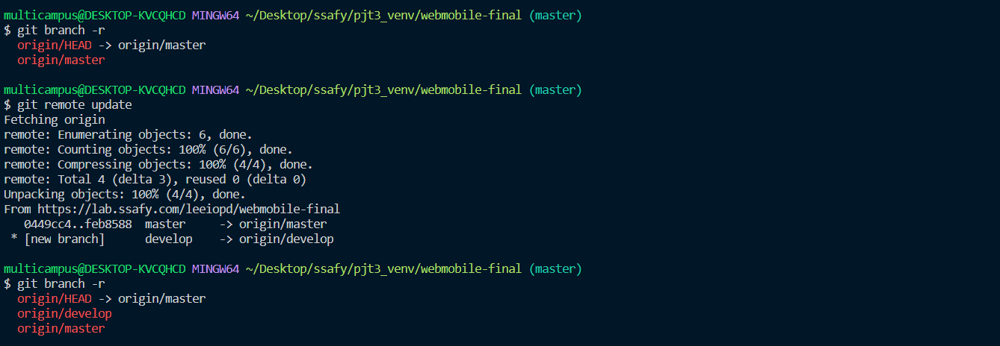
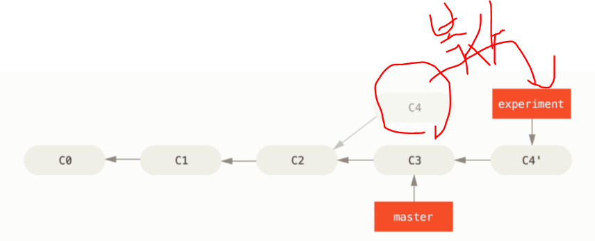
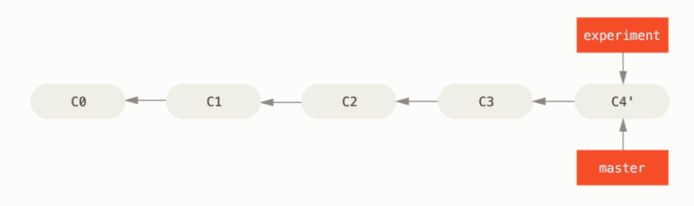

# 너무 어려운 Git!

git 관련 에러 해결

- git config core.quotepath false

하면 한글 깨짐 에러 해결된다.

## 1. Git branch

- `git branch -r` : 지금 브랜치의 로그를 확인한다. 또 어떤것이 있는지 알아보고자 할 때 쓴다.
- `git remote update` : 브랜치 따로 파놓은 것들 어떤것이 있는지 업데이트 하기 

> 다음과 같이 브랜치가 하나 더 생긴것을 알 수 있었다

1. `git checkout develop` : develop branch로 이동한다.
2. `git checkout -b feature/Footer-contact-us-init develop` : 
   `git checkout -b [내가 만들고자 하는 기능 이름] [브랜치명]` 으로 develop에서 파생된 브랜치를 하나 더 만든다
   **중요** : 뒤에 따고자 하는 브랜치 이름 꼭 써주자.. 아니면 master에서 따온다.
3. `git merge --no-ff origin develop` : 디벨롭에서 최신화한 브랜치를 이어작업할 수 있다.
4. 코드 수정 뚝딱뚝딱 하기
5. `git add .` 
6. `git commit -m'YDK|[기능 이걸 했어요!]'`
7. `git rebase -i HEAD~[커밋 갯수]` 
   https://meetup.toast.com/posts/39 : 이거 참고하면 좋다.

8. `git pull --rebase origin develop` : 리베이스로 내꺼가 최신이 되도록 붙여준다.
9. `git push origin feature/Footer-contact-us-init` : 먼저 내가 수정한 브랜치에 등록

8. `gitlab` 이동 후 스스로 머지 리퀘스트를 날리고 받아들일 수 있다.

9. `git checkout develop` : 브랜치 이동

10. `git pull origin develop` : feature 브랜치에서 작성한 내용 가져오는 명령어. remote에 내가 올렸던 코드를 local로 땡겨온다.

11. `git branch -D feature/Footer-contact-us-init` : 기능을 수행하기 위해 만들었던 브랜치를 삭제한다

12. `git push origin --delete feature/Footer-contact-us-init` : remote에도 내가 이 브랜치를 삭제했음을 알린다.

13. 처음 프로젝트 git clone 했을 때

    - develop으로 checkout 해줘야한다.
    
- package-lock.json이 제일 기본이다.
      그걸 기본으로 npm이 install 되기 때문에 처음 설치하려면 npm ci 해주자.
  
- 패키지 제이슨이랑 락 둘다 존재할때
      npm install 하면 lock 을 따르는데 패키지 lock이 없으면 패키지를 따르는게 npm install이다.

    npm install 하면 lock 을 따르는데 

    패키지 lock이 없으면 패키지를 따르는게 npm install

    - 둘다 없어. 그러면 npm init으로 package.json을 생성해준다.

    - <u>처음에 npm ci 해보고 안되면 package-lock 지우고 npm install 해준다.</u>

    package-lock 지우고 npm install 해준다.

    - push 할떄는 package-lock 지우고 push 해준다.
  
    
  
  div에 이미지 꽉 채워넣기
  
  [여기](https://ssungkang.tistory.com/entry/css-div에-이미지-꽉-채우는-방법)
  
  

컴공기초지식

개발에 대한 애정과 배우고자 하는 의지

[싸피 정준희] [오후 4:20] 뭔가를 달성한 경험
[싸피 정준희] [오후 4:20] 코딩을 즐긴다는 흔적

문제를 해결해보려한 흔적 노력들

서류는 무조건 합 온라인 코테에서 거름

지원서 : 코딩에 대한 기초 역량이 얼마나 좋은가
