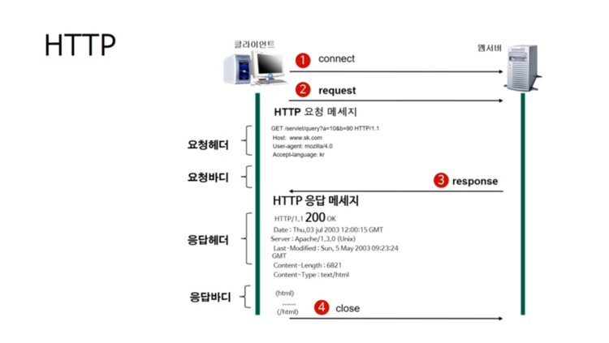

# Http의 이해

### 인터넷(네트웍통신)의 이해

- 인터넷 != www
  - 인터넷 기반의 대표 서비스중 하나이다.
- 인터넷(Internet)
  - 네트워크들의 네트워크.
  - TCP/IP 기반의 네트워크가 전세계적으로 확대되어 하나로 연결된 네트워크들의 네트워크

### HTTP란?

- HTTP는 서버와 클라이언트가 인터넷상에서 데이터를 주고받기 위한 프로토콜이다.
- 종류를 가리지 않고 자료를 전송할 수 있다. 
- 이미지를 포함된 문서나 동영상을 볼 수 있는 이유이다.

### HTTP 작동방식

- 서버/클라이언트 모델을 따른다.
  - 클라이언트가 먼저! 서버에게 **요청**을 보내고, 이 요청을 받아 서버가 클라이언트에게 **응답**을 보낸다.
  - 무상태 프로토콜 이라고도 한다.
- 장점
  - 불특정 다수를 대상으로 하는 서비스에 적합하다. 
  - 클라이언트와 서버가 계속 연결된 형태가 아님. 클라이언트와 서버간의 최대 연결수보다 훨씬 많은 요청과 응답을 처리할 수 있다.
- 단점 
  - 연결을 끊기 때문에, 클라이언트의 이전상황을 알 수가 없다. 이러한 특징을 무상태(Stateless)라고 말한다. 이를 보안하기 위해 Cookie와 같은 기술이 등장하게 되었습니다.

### 

### URL

- 인터넷 상의 자원의 위치
- 특정 웹 서버의 특정 파일에 접근하기 위한 경로 혹은 주소
- 접근 프로토콜+주소 or 도메인 이름  + 문서의 경로 + 문서 이름으로 구성되어 있다.
- Port : 각각의 하나의 방을 포트라고 생각하자.
- IP : 집 주소, 하나의 집이라고 생각하자.

### HTTP

- 요청과 응답이 끈나면 서버가 끊어지게 된다. 
- 정해진 규칙이 있다. - 요청 데이터 포멧이라고 한다.
- 요청 헤더
- 요청 바디 : post 방식일때만 들어온다. get 방식은 요청 바디가 없다.
- 응답 헤더 
- 응답 바디