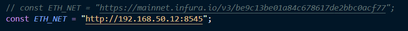
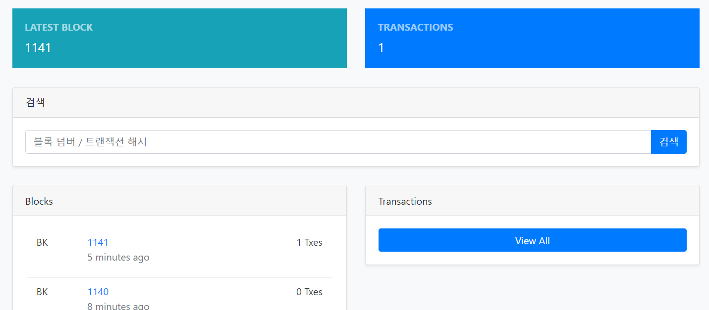

## 블록체인 실습

[TOC]

## 0. 환경 설정

### 0. 준비하기

- vagrant 설치
- virtualbox 설치
- visual studio code 설치

### 1. 가상머신 5개 생성해보기

- /c/dev/eth_prac001 의 경로로 이동해서
- Vagrantfile 에 다음과 같이 루비 언어로 코드 입력

```ruby
# -*- mode: ruby -*-
# vi: set ft=ruby :

# All Vagrant configuration is done below. The "2" in Vagrant.configure
# configures the configuration version (we support older styles for
# backwards compatibility). Please don't change it unless you know what
# you're doing.

VAGRANTFILE_API_VERSION = "2"

vms = {
  eth00: ['10', 4096],
  eth01: ['11', 4096],
  eth02: ['12', 2048],
  eth03: ['13', 2048],
  eth04: ['14', 2048],
}

Vagrant.configure(VAGRANTFILE_API_VERSION) do |config|
  config.vm.box = "ubuntu/bionic64"
  vms.map do |key, value|
    name = key.to_s
    ip_num, mem = value
    config.vm.define "#{name}" do |node|
      node.vm.network "private_network", ip: "192.168.50.#{ip_num}"
      node.vm.hostname = "#{name}"
      node.vm.provider "virtualbox" do |nodev|
        nodev.memory = "#{mem}"
      end
    end
  end
end

```

다음과 같은 파일 작성. 파일은 루비로 작성되어있다.

```
vagrant up
```

와 같이 명령어 입력하면, 5개의 virtual machine이 구동된다. 가상머신이 없다면 가상머신이 설치된다.

- 각각 5개의 가상머신에 대하여 명령어 작성해준다.

```bash
vagrant ssh eth00
```

- 가상머신 접속 명령어이다. 각각의 bash 창 열고 eth01, eth02, eth03, eth04까지 다 실시해준다.

### 2. 별도의 가상머신 접속 및 이더리움 설치

- 각각의 가상머신에 대하여 명령어를 입력해준다.

```bash
sudo apt-get update
sudo apt-get install software-properties-common
sudo add-apt-repository -y ppa:ethereum/ethereum
sudo apt-get install ethereum
버전 뜨는지 확인: geth version
```

### 3. 가상머신 내 디렉토리 생성 및 GENESIS 블록파일 생성

- 마찬가지로 각각의 가상머신에 대하여 명령어를 실시한다.

```bash
mkdir -p /home/vagrant/dev/eth_localdata/ 
cd /home/vagrant/dev/eth_localdata/
sudo vi CustomGenesis.json
밑에꺼 json파일에 붙여넣기
{
  "config": {
        "chainId": 15150,
        "homesteadBlock": 0,
        "eip155Block": 0,
        "eip158Block": 0
    },
  "alloc"      : {},
  "coinbase"   : "0x0000000000000000000000000000000000000000",
  "difficulty" : "0x10",
  "extraData"  : "",
  "gasLimit"   : "9999999",
  "nonce"      : "0xdeadbeefdeadbeef",
  "mixhash"    : "0x0000000000000000000000000000000000000000000000000000000000000000",
  "parentHash" : "0x0000000000000000000000000000000000000000000000000000000000000000",
  "timestamp"  : "0x00"
}

geth --datadir /home/vagrant/dev/eth_localdata/ init /home/vagrant/dev/eth_localdata/CustomGenesis.json
sudo apt install tree
파일 구조 확인 : tree
```

### 4. Go Ethereum 구동

- 명세서 상에서는 eth02를 메인 노드로 지정하고 있다.


```bash

메인서버에서 실행:geth --networkid 15150 --datadir ~/dev/eth_localdata --port 30303 --rpc --rpcport 8545 --rpcaddr 0.0.0.0 --rpccorsdomain "*" --rpcapi  "admin,net,miner,eth,rpc,web3,txpool,debug,db,personal" --allow-insecure-unlock console

다른서버: geth --networkid 15150 --maxpeers 5 --datadir /home/vagrant/dev/eth_localdata/ --port 30304 --allow-insecure-unlock console

노드 정보 확인: admin.nodeInfo.enode 치고 주소 복사한후  admin.addPeer("") 복사한 주소 뒷부분 연결하고자 하는 주소로 바꿔줌 admin.peers로 확인 

```


- 최종적으로 이런식으로 프라이빗 노드를 구축하면 완성!

## 1. 프론트엔드와 노드 네트워크 연동

대장 노드의 아이피를 기억하자.(192.168.50.12) 포트번호는 8545이다. (이더리움 구동시 메인 서버의 포트번호라고 한다)

```bash
personal.newAccount()
패스워드 입력
패스워드 반복입력
miner.start(1)
```

채굴이 시작되었다.

- 스켈레톤 코드의 app.js 이동



- 대장 노드의 아이피와 포트로 수정해준다.


## 2. 이더 트랜잭션하기

https://allg.tistory.com/44 --> 다 나와있음

- EOA 계정 생성

```bash
personal.newAccount("pass0")
```

- EOA 계정 확인

```bash
eth.accounts
eth.accounts[0]
eth.accounts[1]
```

- 트랜잭션 하기

```bash
eth.sendTransaction({from:eth.accounts[0], to:eth.accounts[1], value:web3.toWei(1, "ether")})
```

- 비밀번호가 걸려있다. 이를 해제해주자.

```bash
personal.unlockAccount(eth.accounts[0])
```

- 해제되었으니 송금해주자.



- 송금이 완료되어 트랜잭션에 반영되었다.

