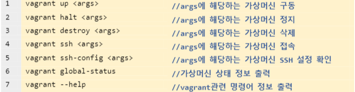

# 블록체인 프로젝트

[TOC]

## 0. 개념 이해

### 1) VirtualBox

- 가상화를 위한 소프트웨어이다.
- 가상화란?
  - 컴퓨터 리소스의 추상화를 일컫는 광범위한 용어이다.
  - 다양한 의존성을 가진 소프트웨어를 구동할 수 있다.
  - 소프트웨어를 하드웨어로부터 독립시켜 구동할 수 있는 기술이다.
  - 하드웨어 가상화(Hypervisor) : 하이퍼바이져를 이용한 하드웨어 가상화에 대한 실습을 배울 예정

### 2) Vagrant

- 가상머신에 대한 프로비저닝(Provisioning)을 지원하는 도구이다.
- 스크립트 작성을 통해 가상머신을 쉽게 생성, 수정, 삭제, 관리할 수 있습니다.
- 프로비저닝이란?(Provisioning)
  - 사용자의 요구에 맞게 미리 시스템 자원을 정의하고 할당 및 베포하였다가 
    필요 시 시스템을 즉시 사용할 수 있도록 준비해두는 것을 말한다.
- <u>설정 파일 하나로 모든 가상머신을 통합 관리할 수 있다는 장점이 있다.</u>

### 3) Geth

- 이더리움에서 제공하는 다양한 API를 사용해볼 수 있다.

### 4) Solidity

- 스마트 컨트랙트 개발 언어
- 튜링완전하다란?(Turing-complete)
  - 프로그래밍 언어나 추상 기계가 튜링 기계와 동일한 계산 능력을 가진다는 의미
  - 계산적인 문제를 그 프로그래밍 언어로 풀 수 있다는 의미

### 5) Remix

- 브라우저 상에서 이용가능한 이더리움 스마트 컨트랙트 개발 도구이다.
- JSVM을 통한 스마트 컨트랙트의 사전 테스트, 베포, 호출을 진행해볼 수 있다.
- 스마트 컨트랙트에 소요되는 Gas를 미리 예상해볼 수 있고, UI를 통한 손쉬운 호출로 이더리움 스마트 컨트랙트를 개발하기에 좋은 도구이다.

### 6) Metamask

- 이더리움 지갑 프로그램의 일종이다. 
- 크롬 확장 프로그램으로 설치가능하다.
- [설치경로](https://chrome.google.com/webstore/detail/metamask/nkbihfbeogaeaoehlefnkodbefgpgknn)

## 1. 하이퍼레저 패브릭 프로젝트

### 1) 개요

- 대표적인 허가형 블록체인, 기업형 블록체인 솔루션으로 알려져있다.
- 체인 코드를 작성해보고 베포해보자.
- 패브릭 네트워크란?
  - 기업형 블록체인의 대표주자.
  - 기업간 시너지를 이끌어내기 위한 블록체인 인프라이다.
  - 완벽한 탈 중앙화는 아님
  - 기업 주도 하에 시장 및 비용의 효율성을 창출하는데 초점을 맞춘 블록체인 기술
  - 참여자간 완전한 분산, 분권화를 지향하는 비허가형 블록체인과는 구성 및 동작방식이 상이하다
  - 네트워크에 진입하기 위한 인증절차 존재.
  - 이러한 인증절차를 통해 구성된 네트워크를 패브릭에서는 '비즈니스 네트워크(Business Network)' 라고 말한다
  - 합의 과정을 정렬 서비스라고 말하며 빠른 거래 검증 및 블록 생성을 지원하고 있다.

### 2) 목적

- 비즈니스 네트워크를 위해 가상의 컨소시엄을 만들자
- 패브릭 네트워크를 구성하자
- 가상의 조직(기업)간의 탈중앙화 협업 모델을 구축해보자

### 3) 기술 스택 및 툴의 특징

- 카프카(Kafka)
  - 분산 메세징, 메세지 큐 기술
  - 넷플릭스, 트위터, 텀블러
  - 실시간 대용량 메세지 및 데이터 처리가 필요한 서비스에 중요한 기술이다
  - 발행-구독 모델사용하여 분산 메세징 서비스 제공
  - 주제(Topic) 별 메세지 분류
    - 주제별로 분류된 메세지는 다시 파티션(Partition)으로 쪼개어 관리하는 특징

- Docker, Docker-compose
  - OS 수준 가상화 프로그램
  - 도커에서 구동하는 프로그램이 요구하는 수준의 리소스만을 할당해준다.
  - 독립적 구동으로 성능 손실이 발생하지 않는다
  - 

