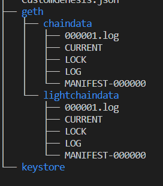
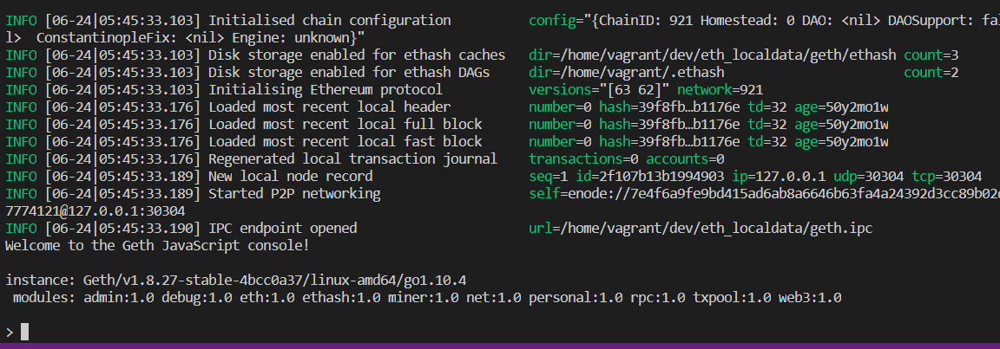
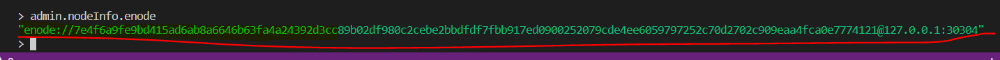
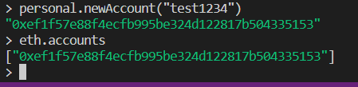
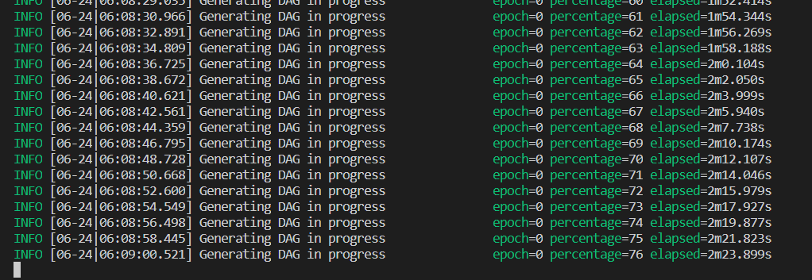

# 실습

1. 사전준비

   ```
   VirtualBox - https://www.virtualbox.org/
   
   Vagrant - https://www.vagrantup.com/
   
   VSCode - https://code.visualstudio.com/
   
   과제
   
   Remix - http://remix.ethereum.org
   
   Metamask - https://metamask.io/
   ```

   설치하자..

   

2. vs code 에서 ctrl+~ 누르면 cmd 생긴다

   ```
   cd c:\dev\eth_prac001
   vagrant init 
   ```

   치면 뭐가 생김

   다 지우고

   ```bash
   Vagrant.configure("2") do |config|
     config.vm.define "eth01" do |eth01|
       eth01.vm.box = "ubuntu/bionic64"
       eth01.vm.hostname = "eth01"
       eth01.vm.network "private_network", ip: "192.168.50.10"
       eth01.vm.provider "virtualbox" do |eth01v|
         eth01v.memory = 4096
       end
     end
     config.vm.define "eth02" do |eth02|
       eth02.vm.box = "ubuntu/bionic64"
       eth02.vm.hostname = "eth02"
       eth02.vm.network "private_network", ip: "192.168.50.11"
       eth02.vm.provider "virtualbox" do |eth02v|
         eth02v.memory = 4096
       end
     end
   end
   ```

   붙여넣기 하자.

   

2. 터미널에서 

   cd c:\dev\eth_prac001 이동해서

   ```
   vagrant up eth01 
   ```

   하면 뭐가 생긴다

   **터미널 하나 더 만들고**

   cd c:\dev\eth_prac001 이동해서

   ```
   vagrant up eth02
   ```

   하면 또 뭐가 생긴다.

   

3. 각각의 bash에서 

   ```
   vagrant ssh 001
   vagrant ssh 002 
   ```

   치면 된다.

4. geth 설치

   eth01, eth02에 

   ```bash
   sudo apt-get update
   sudo apt-get install software-properties-common
   sudo add-apt-repository -y ppa:ethereum/ethereum
   sudo apt-get install ethereum 
   ```

   쳐준다.

5. 

   ```bash
   mkdir -p  dev\eth_localdata
   cd dev\eth_localdata
   vi CustomGenesis.json
   ```

   

6. 

   ```json
   {
     "config": {
       "chainId": 921,
       "homesteadBlock": 0,
       "eip155Block": 0,
       "eip158Block": 0
     },
     "alloc": {},
     "coinbase": "0x0000000000000000000000000000000000000000",
     "difficulty": "0x20",
     "extraData": "",
     "gasLimit": "0x47e7c5",
     "nonce": "0x0000000000000042",
     "mixhash": "0x0000000000000000000000000000000000000000000000000000000000000000",
     "parentHash": "0x0000000000000000000000000000000000000000000000000000000000000000",
     "timestamp": "0x00"
    }
   ```

   입력


7. 

   ```bash
   geth --datadir /home/vagrant/dev/eth_localdata init /home/vagrant/dev/eth_localdata/CustomGenesis.json
   ```

   

8. 

   ```bash
   sudo apt-get install tree
   ```

   tree 하면 트리구조로 볼 수 있다.




9. Geth 구동

   - eth01 가상머신에서 수행

   ```bash
   geth --networkid 921 --maxpeers 2 --datadir /home/vagrant/dev/eth_localdata --port 30303 console
   ```

   - eth02 가상머신에서는 포트 번호만 다르게 하자!!

   ```bash
   geth --networkid 921 --maxpeers 2 --datadir /home/vagrant/dev/eth_localdata --port 30304 console
   ```

   ​	

   이런 창이 뜨면 정상이다.

10. 노드 연결

    노드 정보 확인

    eth01 가상머신 / Geth console

    ```
    admin.nodeInfo.enode
    ```

    

    이상한 정보 나온다.

    이걸 eth02 가상머신으로 가서

    ```
    admin.addPeer(여기에 복붙해보자)
    ```

    쳤을 때 true 나오면 정상이다.

11. 

    eth01 가상머신 Geth console

    ```
    personal.newAccount("test1234")
    ```

    생성된 계정 확인

    eth01 가상머신 / Geth console

    ```
    eth.accounts
    ```

    

12. 트랜잭션 생성

    - 트랜잭션 생성을 위한 이더 채굴

    - eth01 가상머신 / Geth console

      ```
      miner.start(1)
      ```

      

      채굴중....

    - 멈추고 싶다면?

      ```bash
      miner.stop()
      ```

    - 채굴 보상으로 획득한 이더 확인

      ```
      eth.getBalance(아까 만든 계정 넣어보자)
      ```

      ```
      eth.sendTransaction({from:"계정주소",to:"eth02account",value: web3.toWei(1,"ether")})
      ```

      

### MetaMask 설치

1. 테스트 서버 Ropsten 테스트환경으로 바꿔주고 입금 누름.

2. 파우셋 테스트 - 이더 얻기 클릭!
3. request 1 ether from faucet 클릭!

> 1 ether가 내 지갑에 들어온다.


remix 생성.

0.5.2 버전 이상 해야됨.


```remix
pragma solidity 0.5.2;

contract SimpleStorage{
    
    uint256 value;
    
    constructor() public{
        value=0;
    }
    function setValue(uint256 _value)public{
        value =_value;
    }
    function getValue() public view returns (uint256){
        return value;
    }
}
```

view : 값을 그냥 본다.


### solidity 개발 과제

> Self-Check List(1/2)

- Voter 구조체와 Proposal 구조체의 쓰임에 대해 설명할 수 있는가?
  - 각 구조체는 어떠한 정보를 담기위함인가?
    - 구조체를 구성하는 각 변수
  - 구조체와 구조체의 리스트를 선언하고 사용할 수 있는가?
- msg.sender는 무엇을 뜻하는가?
  - msg.sender 와 같은 특성을 갖는 변수를 무엇이라 지칭하는가?

- 조건문, 반복문을 사용할 수 있는가?
- 생성자 및 함수의 선언을 이해할 수 있는가?

> Self-Check List(2/2)

- 생성자 및 함수의 동작을 설명할 수 있는가?
  - constructor
  - givRightToVote(address toVoter)
  - delegate(address to)
  - vote(uint8 toProposal)
  - winningProposal() returns (uint8 _winningProposal)
- givRightToVote 함수의 if문을 require문으로 변경할 수 있는가?
- 함수 내 storage 변수를 설명할 수 있는가?
- Openzeppelin SafeMath 라이브러리를 사용하여 코드를 변경할 수 있는가?
- Ballot.sol은 모든 참가자에게 투표권을 부여할 수 있는 형태인가?
  여러 투표에 투표할 수 있는 커트랙트로 확장할 수 있는 방법은 무엇인가?

### 솔리디티 개발 과제 2

- 스마트 컨트랙트 요구사항 명세
  - 솔리디티 컴파일러는 0.5.2 버전 이상을 사용한다.
  - 주요 차이
    - view -> constant
    - 생성자 -> function ContractName()~
- ERC20을 준수하는 토큰의 특징은 다음과 같다
  - Token name = MyCustomToken
  - Token symbol = "MCT"
  - Token total supply = 10억개
  - Token decimals = 18
  - Token per ETH = 10 ( 1 eth 당 10 MCT)

- 필수적으로 구현해야할 컨트랙트 및 함수는 다음과 같다.

1. Voter 구조체와 Proposal 구조체의 쓰임에 대해 설명할 수 있는가?

   1. 각 구조체는 어떠한 정보를 담기위함인가?

      Voter 구조체는 weight, voted, vote, delegate 정보를 담기 위함이다.

      

