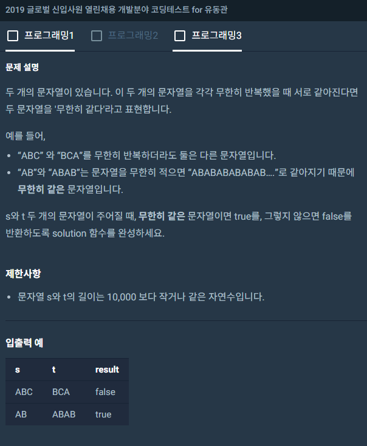
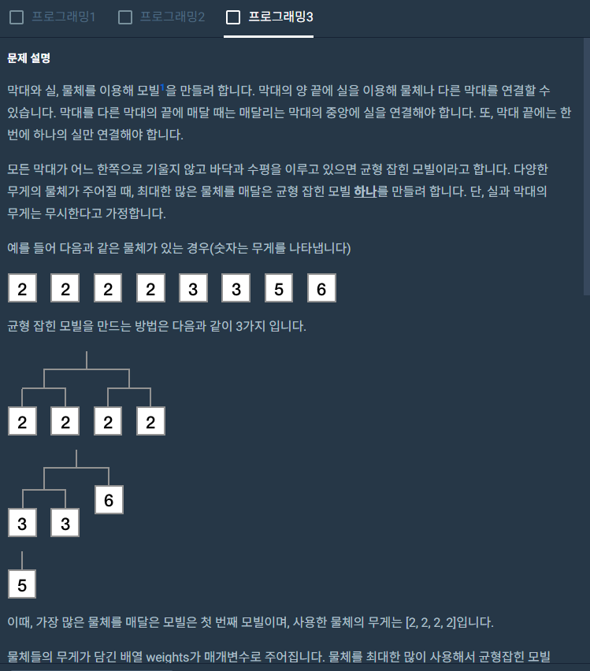
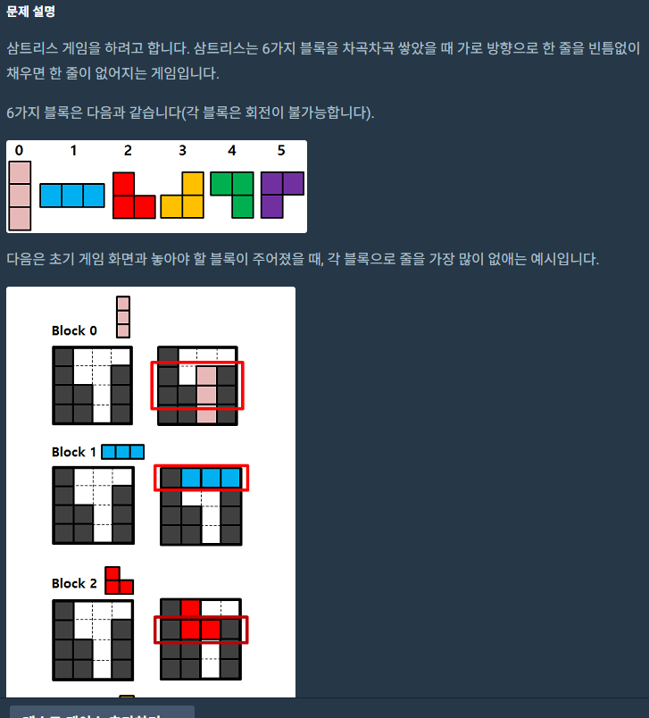

# 알고리즘 공부한거

### 1. [에라토스테네스의 체](https://marobiana.tistory.com/91)

   - ```c++
     #include<iostream>
     #include<vector>
     using namespace std;
     
     void getche(int num) {
     	int* arr = new int[num];
         // 프로그래머스에서는 vector사용을 권장하는 것 같다.
         vector<int> arr(n+1);
     	for (int i = 2; i <= num; i++) {
     		arr[i] = i;
     	}
     
     	// 배수는 모두 0으로 처리해준다. 체를 거르는 것처럼 걸른다.
     	for (int i = 2; i <= num; i++) {
     		if (arr[i] == 0) {
     			continue;
     		}
     		// 배수는 다 걸른다. 0으로 만듬.
     		for (int j = i*2; j <= num; j+=i) {
     			arr[j] = 0;
     		}
     	}
     	for (int i = 2; i <= num; i++) {
     		if(arr[i]!=0)
     			cout << arr[i] << " ";
     	}
     }
     int main() {
     	int num;
     	cin >> num;
     	getche(num);
         return 0;
	    }
     
     ```

### 2. map 개념

   - 완주하지 못한 선수. 

     ```c++
     #include <string>
     #include <vector>
     #include <map>
     
     using namespace std;
     
     string solution(vector<string> participant, vector<string> completion) {
         string answer = "";
         unordered_map<string, int> strMap;
         for(auto elem : completion)
         {
             if(strMap.end() == strMap.find(elem))
                 strMap.insert(make_pair(elem, 1));
             else
                 strMap[elem]++;
         }
     
         for(auto elem : participant)
         {
             // 반복자 호출하기.
             if(strMap.end() == strMap.find(elem))
             {
                 answer = elem;
                 break;
             }
             else
             {
                 strMap[elem]--;
                 if(strMap[elem] < 0)
                 {
                     answer = elem;
                     break;
                 }
             }
         }
         return answer;
     }
     ```

### 3. 모의고사

   - 센스가 필요한 문제... if for vector만으로 이렇게 풀어내다니....ㅠㅡㅠ

     ```c++
     #include <string>
     #include <vector>
     #include <algorithm>
     #include <math.h>
     #include<iostream>
     
     using namespace std;
     
     vector<int> solution(vector<int> answers) {
     	vector<int> p1({ 1,2,3,4,5 });
     	vector<int> p2({ 2,1,2,3,2,4,2,5 });
     	vector<int> p3({ 3,3,1,1,2,2,4,4,5,5 });
     
     	int c1 = 0;
     	int c2 = 0;
     	int c3 = 0;
     	for (int i = 0; i < answers.size(); i++) {
     		int i1 = i % 5;
     		int i2 = i % 8;
     		int i3 = i % 10;
     
     		if (answers[i] == p1[i1]) { c1++; };
     		if (answers[i] == p2[i2]) { c2++; };
     		if (answers[i] == p3[i3]) { c3++; };
     	}
     	int mc = max(c1, max(c2, c3));
     	vector<int> ans;
     	if (mc == c1) ans.push_back(1);
     	if (mc == c2) ans.push_back(2);
     	if (mc == c3) ans.push_back(3);
     
     	return ans;
     }
     int main() {
     	vector<int> a({ 1,2,3,4,5 });
     	
     	vector<int> s=solution(a);
     	for (int i = 0; i < s.size(); i++) {
     		cout << s[i] << " ";
     	}
     }
     ```

### 4. vector.assign()

   ```c++
   vector<int> a{1,2,3,4,5,6,7,8,9};
   vector<int> b;
   int i=2,j=5,k=3;
   b.assign(a.begin()+i-1,a.begin()+j);	//{2,3,4,5,6}
   return b[k-1];
   ```

### 5. 번째에 관한 고찰..

   번째라는 말은 참 힘들다. 첫번째는 인덱스 0부터 시작하고, 3번째 수를  구하시오 하면 인덱스는 2다. 생각해보니 인덱스 하나씩만 줄이면 전혀 문제가 되지 않을 것 같다..!

   {1,2,3,4,5,6,7}에서 두번째에서 다섯번째까지 구하라는 문제가 나오면 {2,3,4,5}인덱스는 1~4이다.


### 6. vecrot.erase() method

   벡터에는 특정 위치의 요소를 제거하고, 제거된 요소의 수만큼 크기가 줄어드는 효율적인 erase() 메서드가 있다.


### 7. 날짜구하는 알고리즘.

   ```c
   #include <string>
   #include <vector>
   
   using namespace std;
   
   string solution(int a, int b) {
      vector<string> month = {"FRI","SAT","SUN","MON","TUE","WED","THU"};
       vector<int> day={31,29,31,30,31,30,31,31,30,31,30,31};
       int cnt = 0;
       for(int i=0;i<a-1;i++){
           cnt+=day[i];
       }
       cnt+=b-1;
       
       return month[cnt%7];
   }
   ```


### 8. 중복 제거 알고리즘

   ```c
   #include <vector>
   #include <iostream>
   
   using namespace std;
   
   vector<int> solution(vector<int> arr)
   {
   	vector<int> answer;
   	answer.push_back(arr[0]);
   	for (int i = 1; i < arr.size(); i++) {
   		if (answer.back() != arr[i]) {
   			answer.push_back(arr[i]);
   		}
   	}
   	return answer;
   }
   ```

   2번째 다른 방법.

   ```c
   #include <vector>
   #include <iostream>
   #include <algorithm>
   using namespace std;
   
   vector<int> solution(vector<int> arr) 
   {
   
       arr.erase(unique(arr.begin(), arr.end()),arr.end());
   
       vector<int> answer = arr;
       return answer;
   }
   ```

   

### 9. vector.at() 

오름차순 정렬일 때는 < 이걸 써주자.

```c
sort(answer.begin(),answer.end(),custom);
```


1. 

2. 

   ```c
   #include<string>
   using namespace std;
   
   bool solution(string s, string t)
   {
       string big,small;
       if(s.length()==t.length()){
           if(s==t){
               return true;
           }else{
               return false;
           }
       }else if(s.length()>t.length()){
           big=s;small=t;
       }else if(s.length()<t.length()){
           big=t;small=s;
       }
       for(int i=0;big.length()!=small.length();i++){
           int i1=i%small.length();
           small+=small[i1];
       }
       if(big==small){
           return true;
       }else{
           return false;
       }
   
   ```

   


2. 

```c
#include<vector>
#include<iostream>
#include<algorithm>

using namespace std;

int check(vector<vector<int>> board) {
	int count = 0;
	for (int i = 0; i < board.size(); i++) {
		int tmp = 0;
		for (int j = 0; j < board[i].size(); j++) {
			if (board[i][j] == 1) {
				tmp++;
			}
		}
		if (tmp == 4) {
			count++;
		}
	}
	return count;
}
void print(vector<vector<int>> board) {
	for (int i = 0; i < board.size(); i++) {
		for (int j = 0; j < board[i].size(); j++) {
			cout << board[i][j] << " ";
		}
		cout << endl;
	}
	cout << endl;
}
int solution(int block, vector<vector<int>> board) {
	int ans = 0;
	switch (block)
	{
	case 0:
		for (int i = 0; i < board.size()-2; i++) {
			for (int j = 0; j < board[i].size(); j++) {
				if (board[i][j] == 0 && board[i + 1][j] == 0 && board[i + 2][j] == 0) {
					board[i][j] = 1;
					board[i + 1][j] = 1;
					board[i + 2][j] = 1;
					int tmp = check(board);
					ans = max(tmp, ans);
					print(board);
					board[i][j] = 0;
					board[i + 1][j] = 0;
					board[i + 2][j] = 0;
				}
			}
		}
		break;
	case 1:
		for (int i = 0; i < board.size(); i++) {
			for (int j = 0; j < board[i].size()-2; j++) {
				if (board[i][j] == 0 && board[i][j+1] == 0 && board[i][j+2] == 0) {
					board[i][j] = 1;
					board[i][j + 1] = 1;
					board[i][j + 2] = 1;
					int tmp = check(board);
					ans = max(tmp, ans);
					board[i][j] = 1;
					board[i][j + 1] = 1;
					board[i][j + 2] = 1;
				}
			}
		}
		break;
	case 2:
		for (int i = 0; i < board.size()-1; i++) {
			for (int j = 0; j < board[i].size() - 1; j++) {
				if (board[i][j] == 0 && board[i + 1][j] == 0 && board[i + 1][j + 1] == 0) {
					board[i][j] = 1;
					board[i + 1][j] = 1;
					board[i + 1][j + 1]=1;
					int tmp = check(board);
					ans = max(tmp, ans);
					board[i][j] = 0;
					board[i + 1][j] = 0;
					board[i + 1][j + 1] = 0;
				}
			}
		}
		break;
	case 3:
		for (int i = 0; i < board.size() - 1; i++) {
			for (int j = board[i].size() - 1; j >=1 ; j--) {
				if (board[i][j] == 0 && board[i + 1][j] == 0 && board[i + 1][j -1] == 0) {
					board[i][j] = 1;
					board[i + 1][j] = 1;
					board[i + 1][j - 1] = 1;
					int tmp = check(board);
					ans = max(tmp, ans);
					print(board);
					board[i][j] = 0;
					board[i + 1][j] = 0;
					board[i + 1][j - 1] = 0;
				}
			}
		}
		break;
	case 4:
		for (int i = 0; i < board.size() - 1; i++) {
			for (int j = 0; j <board[i].size()-1; j++) {
				if (board[i][j] == 0 && board[i][j+1] == 0 && board[i+1][j+1] == 0) {
					board[i][j] = 1;
					board[i][j+1] = 1;
					board[i + 1][j + 1] = 1;
					int tmp = check(board);
					ans = max(tmp, ans);
					print(board);
					board[i][j] = 0;
					board[i][j+1] = 0;
					board[i + 1][j + 1] = 0;
				}
			}
		}
		break;
	case 5:
		for (int i = 0; i < board.size() - 1; i++) {
			for (int j = 0; j < board[i].size() - 1; j++) {
				if (board[i][j] == 0 && board[i + 1][j] == 0 && board[i][j+1] == 0) {
					board[i][j] = 1;
					board[i + 1][j] = 1;
					board[i][j + 1] = 1;
					int tmp = check(board);
					ans = max(tmp, ans);
					print(board);
					board[i][j] = 0;
					board[i + 1][j] = 0;
					board[i][j + 1] = 0;
				}
			}
		}
		break;
	}
	return ans;
}

int main() {
	//vector<vector<int>> board(4, vector<int>(4, 0));
	vector<vector<int>> board({ 
		vector<int>({ 1,0,0,0 }),

		vector<int>({ 1,0,0,1 }),

		vector<int>({ 1,1,0,1 }),

		vector<int>({ 1,1,0,1 })
		});
	int block = 4;

	int ans = solution(block, board);

	cout << ans << endl;

	return 0;
}
```

3. ```c
   #include <string>
   #include <vector>
   #include <unordered_map>
   #include<algorithm>
   
   using namespace std;
   
   int solution(vector<int> weights) {
       int answer = 0;
       unordered_map<int,int> map;
       for(auto el:weights){
           if(map.end()==map.find(el)){
               map.insert(make_pair(el,1));
           }else{
               map[el]++;
           }
       }
       int key=-1;
       int count=-1;
       for(auto i=map.begin();i!=map.end();i++){
           int n=i->second;
           if(n==(n&-n)){
               //2의 거듭제곱이라면
               if(n>count){
                   //갱신이 된다면
                   key=i->first;
                   count=n;
               }
           }
           else{
               while(n!=(n&-n)){
                   n--;
               }
               if(n>count){
                   key=i->first;
                   count=n;
               }
           }
       }
       answer=count;
       int mul=count*key;
       for(auto i=map.begin();i!=map.end();i++){
           int _key=i->first;
           int _val=i->second;
           int tmp=_key*_val;
           if(key!=_key && mul==tmp){
               answer+=_val;
           }
       }
   
       return answer;
   }
   ```

   

   



### 10. vector.at()

 - 위치가 어디인지 표시해주는 함수. 문자열 비교할 때도 유용한 것 같다.

 - 특정 문자열 위치 기준으로 정렬해줄때 쓰임.

 - ```c
   #include <string>
   #include <vector>
   #include<algorithm>
   
   using namespace std;
   int N;
   bool mysort(string a,string b){
       if(a.at(N)!=b.at(N)){
           return a.at(N)<b.at(N);
       }else{
           return a<b;
       }
   }
   vector<string> solution(vector<string> strings, int n) {
       N=n;
       sort(strings.begin(),strings.end(),mysort);
       vector<string> answer;
       answer=strings;
       return answer;
   }
   ```

### 11. 대소문자 변환하기

- 대소문자 구분하는 라이브러리 

- 문자열 갯수 비교해주는 함수.

  ```c
  #include <string>
  #include <iostream>
  #include<cctype>
  using namespace std;
  
  bool solution(string s)
  {
  	int n1 = 0;
  	int n2 = 0;
  	for (int i = 0; i < s.size(); i++) {
          // 반영하기 위해서 다시 그 값을 넣어주는게 중요한 것 같다.
  		s[i]=tolower(s[i]);
  		if (s[i] == 'p') {
  			n1++;
  		}
  		else if (s[i] == 'y') {
  			n2++;
  		}
  	}
  	if (n1 == n2) {
  		return true;
  	}
  	else {
  		return false;
  	}
  }
  ```

- 다른사람이 구현한 깔끔한 코드도 있었다..

  ```c
  #include <string>
  #include <iostream>
  using namespace std;
  
  bool solution(string s)
  {
      int p = 0;
      int y = 0;
      for (int i = 0; i < s.length(); i++) {
          if (s[i] == 'p' || s[i] == 'P')
              p++;
          else if (s[i] == 'y' || s[i] == 'Y')
              y++;
      }
      return p == y;
  }
  ```

  굳이 대소문자 변환을 안써도 이렇게 써도 되는구나 싶었다.

### 12. STL greater option

sort() STL을 사용할 때 greater 옵션을 주면 내림차순 정렬이 가능하다.

- 아스키코드를 사용할 때 대문자보다 소문자가 번호가 더 크다. 대문자 65-95, 소문자 97-122.

- ```c
  #include <string>
  #include <vector>
  #include <algorithm>
   
  using namespace std;
   
  string solution(string s) {
      string answer = s;
      sort(answer.begin(),answer.end(),greater<char>());
      return answer;
  }
  ```

- 다른 재미있는 코드도있었다. rbegin, rend() method...

- ```c
  #include <string>
  #include <vector>
  #include <algorithm>
  using namespace std;
  
  string solution(string s) {
      string answer = "";
      sort(s.rbegin(),s.rend());
  
      return s;
  }
  ```

### 12. isDigit() 

- ```c
  #include <string>
  #include <vector>
  #include<iostream>
  
  using namespace std;
  
  bool solution(string s) {
  	if (!(s.length() == 4 || s.length() == 6)) {
  		return false;
  	}
  	for (int i = 0; i < s.length(); i++) {
  		if (!isdigit(s[i])) {
  			return false;
  		}
  		/*int n = s[i] - '0';
  		if (!(0 <= n && n <= 9)) {
  			return false;
  		}*/
  	}
  	return true;
  }
  ```

### 13. find() 함수 사용법 

- 정말 유용한 stl 이 많다....짱짱

```c
#include <string>
#include <vector>
#include <algorithm>
 
using namespace std;
 
string solution(vector<string> seoul) {
    string answer = "";
    answer = "김서방은 "+to_string(distance(seoul.begin(),find(seoul.begin(),seoul.end(),"Kim"))) + "에 있다";
    //to_string(find(seoul.begin(),seoul.end(),"Kim") - seoul.begin())
    return answer;
}
```

### 14. 재귀 사용법

- 10000이라 엄청난 재귀가 사용될 것 같지만 재귀의 개념을 확실하게 알게된 쉬운 예제라고 생각하여 가져와봤음.

- 수박수박수박수박수박수라는 문제임

- ```c
  #include <string>
  #include <vector>
  
  using namespace std;
  
  string s1 = "수";
  string s2 = "박";
  
  string solution(int n) {
      if(n == 1) return s1;
      if(n % 2 == 0) return solution(n - 1) + s2;
      else return solution(n - 1) + s1;
  }
  ```

  또라이같이 푼 문제라 가져와봄.

